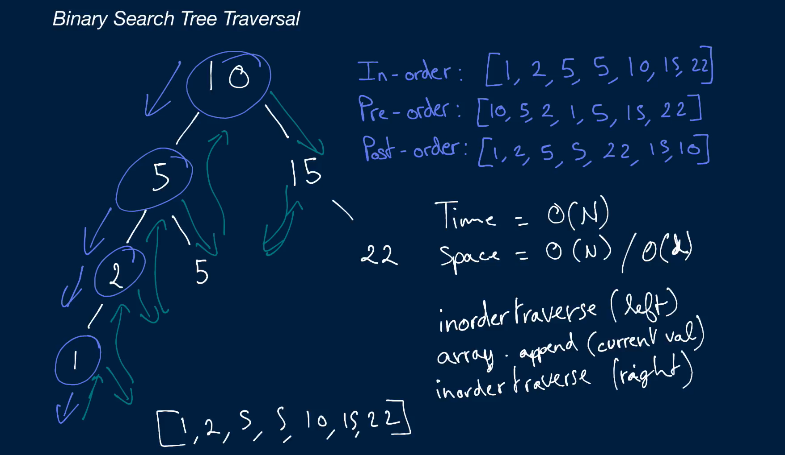

# BST Traversal

  Write three functions that take in a Binary Search Tree (BST) and an empty
  array, traverse the BST, add its nodes' values to the input array, and return
  that array. The three functions should traverse the BST using the in-order,
  pre-order, and post-order tree-traversal techniques, respectively.

  If you're unfamiliar with tree-traversal techniques, we recommend watching the
  Conceptual Overview section of this question's video explanation before
  starting to code.

  Each BST node has an integer value, a
  left child node, and a right child node. A node is
  said to be a valid BST node if and only if it satisfies the BST
  property: its value is strictly greater than the values of every
  node to its left; its value is less than or equal to the values
  of every node to its right; and its children nodes are either valid
  BST nodes themselves or None / null.

## Sample Input

<pre>
  tree =   10
        /     \
        5      15
      /   \       \
    2     5       22
  /
1
  array = []
</pre>

## Sample Output

<pre>

  inOrderTraverse: [1, 2, 5, 5, 10, 15, 22] // where the array is the input array
  preOrderTraverse: [10, 5, 2, 1, 5, 15, 22] // where the array is the input array
  postOrderTraverse: [1, 2, 5, 5, 22, 15, 10] // where the array is the input array
</pre>

## Hints 1

Realize that in-order traversal simply means traversing left nodes before traversing current nodes before traversing right nodes. Try implementing this algorithm recursively by calling the inOrderTraverse method on a left node, then appending the current node's value to the input array, and then calling the inOrderTraverse method on a right node.

## Hint 2

Apply the same logic described in Hint #1 for the two other traversal methods, but change the order in which you do things.

## Optimal Space & Time Complexity

All three methods: O(n) time | O(n) space - where n is the number of nodes in the BST
