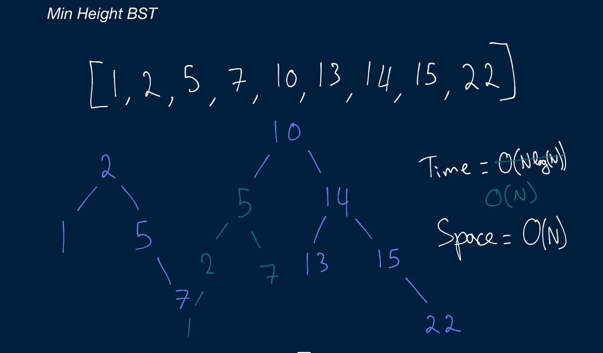

# Min Height BST

  Write a function that takes in a non-empty sorted array of distinct integers,
  constructs a BST from the integers, and returns the root of the BST.

  The function should minimize the height of the BST.

  You've been provided with a BST class that you'll have to use to
  construct the BST.

  Each BST node has an integer value, a
  left child node, and a right child node. A node is
  said to be a valid BST node if and only if it satisfies the BST
  property: its value is strictly greater than the values of every
  node to its left; its value is less than or equal to the values
  of every node to its right; and its children nodes are either valid
  BST nodes themselves or None / null.

  A BST is valid if and only if all of its nodes are valid
  BST nodes.

  Note that the BST class already has an insert method
  which you can use if you want.

## Sample Input

<pre>
  array = [1, 2, 5, 7, 10, 13, 14, 15, 22]
</pre>

## Sample Output

<pre>
         10
       /     \
      2      14
    /   \   /   \
   1     5 13   15
          \       \
           7      22
// This is one example of a BST with min height
// that you could create from the input array.
// You could create other BSTs with min height
// from the same array; for example:
         10
       /     \
      5      15
    /   \   /   \
   2     7 13   22
 /           \
1            14
</pre>

## Hint 1

In order for the BST to have the smallest height possible, it needs to be balanced; in other words, it needs to have roughly the same number of nodes in its left subtree as in its right subtree.

## Hint 2

How can you use the sorted nature of the input array to construct a balanced BST?

## Hint 3

Grab the middle element of the array, and make that element be the root node of the BST. Then, grab the middle element between the beginning of the array and the first middle element, and make that element be the root of the BST's left subtree; similarly, make the middle element between the end of the array and the first middle element be the root of the BST's right subtree. Continue this approach until you run out of elements in the array.

## Optimal Space & Time Complexity

O(n) time | O(n) space - where n is the length of the array
